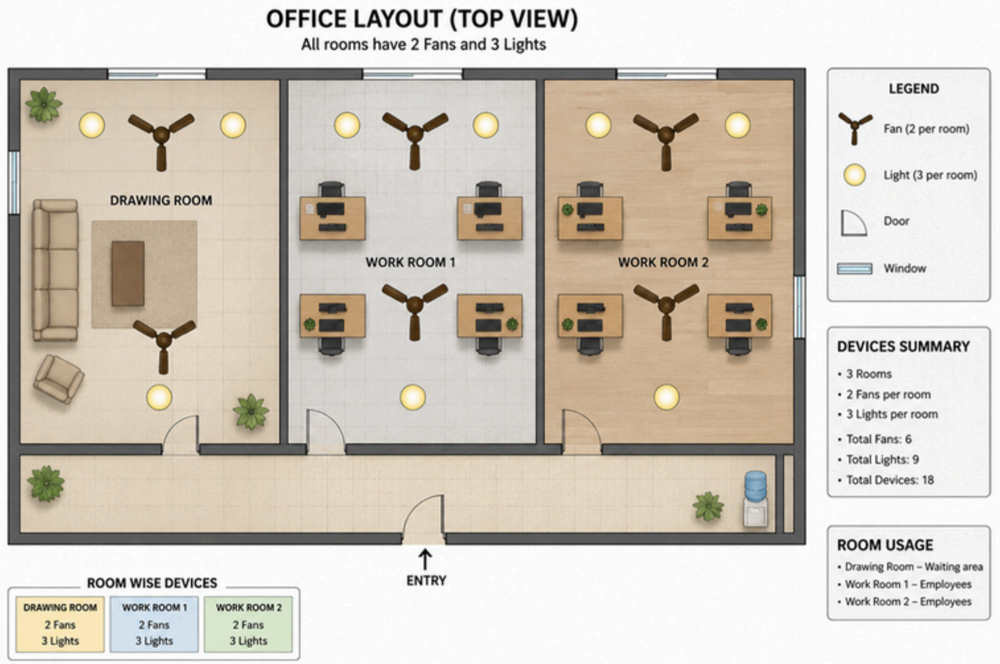

# Lights, Fans, Discord: The Boss's Big Idea

## Scenario

You work at a small office where everything happens on Discord - standups, memes, lunch plans, all of it. There's just one recurring problem: people leave the lights and fans running when they head home. The electricity bill keeps climbing, and nobody notices until it's too late.

Your boss—a self-proclaimed "tech enthusiast" with just enough knowledge to be dangerous and a deep love for weird, out-of-the-box ideas—bursts in one day with his latest brainwave:

> "What if I could see every light and fan in the office on a live dashboard? And check how much power we're burning? And ask a bot about it right from Discord?"

Naturally, he turns to you, his trusted right-hand person who somehow always makes his strange ideas actually work.

**Your mission:** Design and build a system that lets anyone monitor the office's electrical devices and electricity usage through both a web dashboard and a Discord bot.

---

## The Office Setup

The office has a fixed setup for everyone consisting of 3 rooms:

- **Drawing Room:** A waiting area where people occasionally sit.
- **Work Room 1:** Where employees work.
- **Work Room 2:** Where employees work.

**Device Distribution:** Every room has the same devices: 2 fans and 3 lights (5 devices per room, 15 devices total across the office).

---

## What You Must Deliver

### 1. A High-Level System Diagram

A clear picture showing how everything connects:
`Devices → Simulated Data Backend → Web Dashboard + Discord Bot → User`

Show the full flow of information from a device's state all the way to both a Discord message and a live web dashboard update.
_(Note: Do not use Mermaid for your diagrams. Use any other diagramming tool or draw it manually.)_

### 2. A Hardware/Electrical Schematic

A circuit design in Wokwi or Tinkercad showing how these devices would be wired and sensed in real life—for example, a microcontroller (ESP32/Arduino) reading the on/off state of lights and fans, and optionally sensing current draw.

This is a simulation/concept only—no real hardware is needed. You don't have to wire all 15 devices; a representative circuit for one room is enough, but the design must make physical sense.

### 3. Simulated Device Data

Since there's no real hardware, generate dummy data that represents the current state of all 15 devices. Each device should have:

- **Status:** `on` or `off`
- **Power draw:** A realistic wattage when on (e.g., a fan at 60W, a light at 15W)
- **Room:** Which of the three rooms it belongs to
- **Last changed:** A timestamp for when its state last changed

The data should be dynamic—it should change over time (even if simulated), so the dashboard always has something live to show. You can use a script, an in-memory store, a JSON file with a simulator, or a small database—your choice.

### 4. The Web Dashboard

A real-time web dashboard that acts as the main interface for monitoring the office. It should give the boss a clear, live picture of everything happening in the office at a glance.

- **BONUS Points:** It would be great to show a top-view office layout on the dashboard with lights, fans, chairs, tables, and other assets where device states will be reflected visually—for example, lights should glow when ON, and fans should animate when running.

#### Minimum Required Features:

- **Live Device Status Panel:** Show the current on/off state of all 15 devices, organized by room. Each device should be clearly identified (e.g., "Fan 1", "Light 3") with a visual indicator for its state. The panel must update in real time without requiring a page refresh.
- **Live Power Consumption Meter:** Show the total power currently being drawn across the entire office (in Watts). Also show a per-room breakdown. This should update live alongside the device panel.
- **Active Alerts Panel:** A visible section that highlights anomalous situations—for example, devices left on after office hours (assume office hours are 9 AM–5 PM), or a room where all devices have been on for more than 2 hours continuously. Alerts must be timestamped.

### 5. The Discord Bot

A bot living in a Discord server that answers questions about the office on demand. It must pull data from the same backend as the web dashboard, so both interfaces always reflect the same reality. The Discord bot serves as the boss's quick-access remote control.

#### Minimum Required Commands:

| Command        | What it should do                                  | Example Response                                                                                  |
| :------------- | :------------------------------------------------- | :------------------------------------------------------------------------------------------------ |
| `!status`      | Shows the current device overview across all rooms | "Drawing Room: 1 fan ON, 2 lights ON. Work Room 1: all off. Work Room 2: 2 fans ON, 3 lights ON." |
| `!room <name>` | Status of a specific room (e.g., `!room work1`)    | Detailed breakdown of the specified room's devices.                                               |
| `!usage`       | Real-time and estimated cumulative metrics         | "Total power right now: 740W. Today's estimated usage: 4.2 kWh."                                  |

- The bot must give real answers from the actual simulated data, not hardcoded or random responses.
- Responses should be humanized and friendly—the boss hates robotic data dumps. Using an LLM to generate conversational responses is strongly encouraged.
- **Bonus:** The bot proactively posts a message to a designated Discord channel when an alert condition is triggered—e.g., _"Hey! Work Room 2 still has 2 fans and 3 lights ON and it's 10 PM. Did someone forget to leave?"_

---

## Architecture Requirement

The web dashboard and the Discord bot must share a single backend. There should be one source of truth for device state—both interfaces read from it.

`[Simulated Device Layer] → [Backend API] → [Web UI] && [Discord Bot]`

---

## Clarifications

1.  No physical hardware required. Device data in the demo should be simulated.
2.  The bot and dashboard must reflect the same live data—they share one backend.
3.  Dashboard updates must happen without a manual page refresh.
4.  You decide exact command names, UI layout, and visual design—just keep it usable and clean.
5.  Any programming language, library, or AI/LLM is allowed (using an LLM to generate friendly, conversational responses is highly encouraged).
6.  **Tip:** Take time to explore both Wokwi and Tinkercad before picking one—some platforms work better with AI-assisted development over the other.

---

## Evaluation Criteria

| Criterion                                          | Weight |
| :------------------------------------------------- | :----: |
| Working web dashboard with real-time data          |  20%   |
| Working Discord bot reflecting real simulated data |  10%   |
| Dashboard visuals and UX quality                   |  10%   |
| Clear, correct system diagram                      |  15%   |
| Sensible Circuit schematic                         |  15%   |
| Quality of demo & dummy data simulation            |  15%   |
| Well-structured and documented Codebase, Commits   |  15%   |

---

## Deliverables

- **Public Codebase:** Your full source code must be publicly accessible (e.g., a public GitHub/GitLab repository) with a clear README explaining how to set up and run the entire project—backend, dashboard, and bot. Include all diagrams in the repository.
- **Video Demo (max 3 minutes preferred):** A short video walking through your working solution. Show the web dashboard live, the Discord bot in action, and briefly explain the overall data flow and architecture. Keep it concise and clear.

---

## Office Layout Reference (Summary Data)

- **Total Rooms:** 3 (Drawing Room, Work Room 1, Work Room 2)
- **Devices Per Room:** 2 Fans, 3 Lights
- **Total Inventory:** 6 Fans, 9 Lights (15 Total Devices)
- **Room Usage Profiles:**
  - **Drawing Room:** Waiting area
  - **Work Room 1:** Employees workspace
  - **Work Room 2:** Employees workspace

