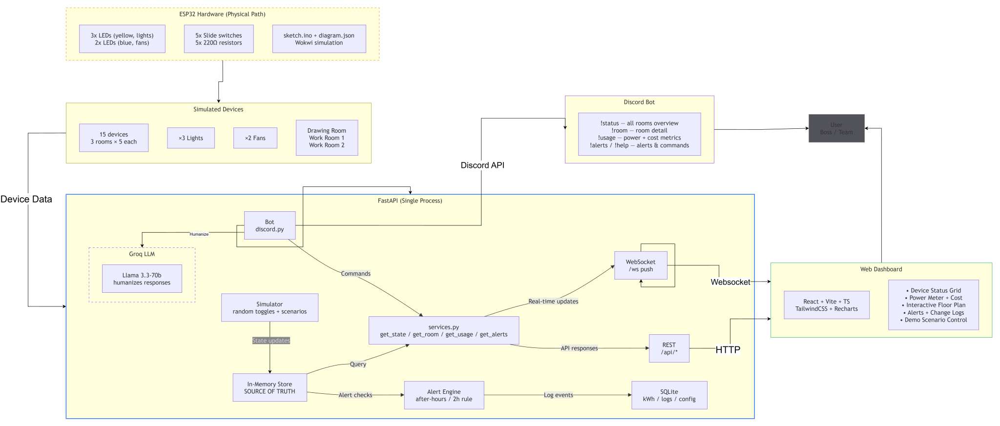
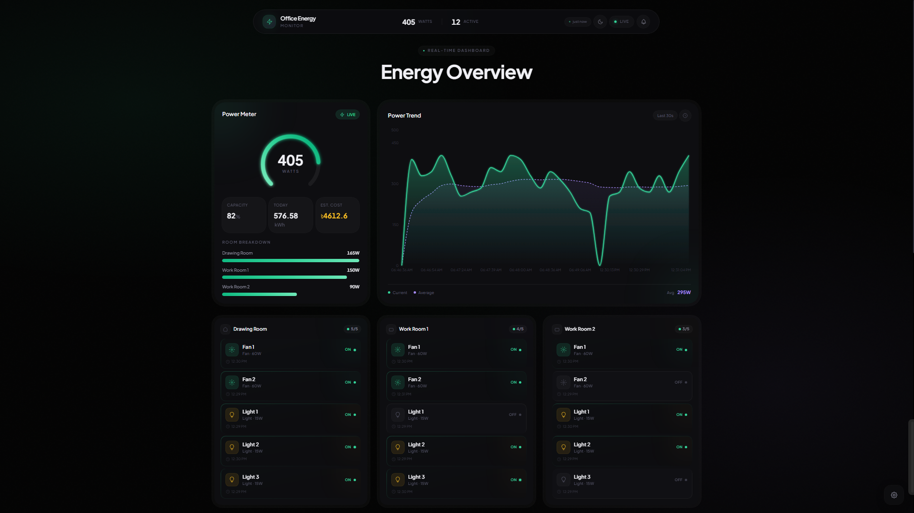
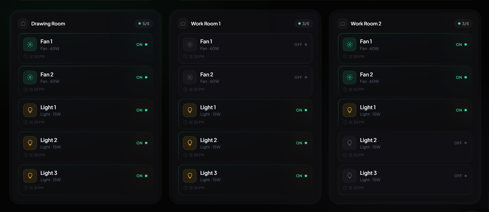
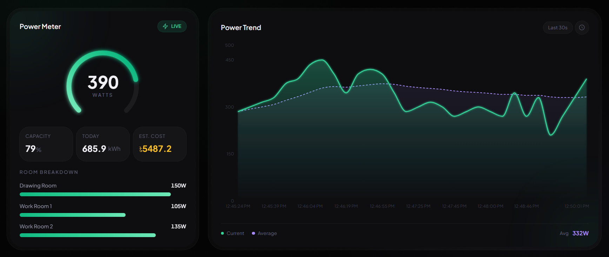
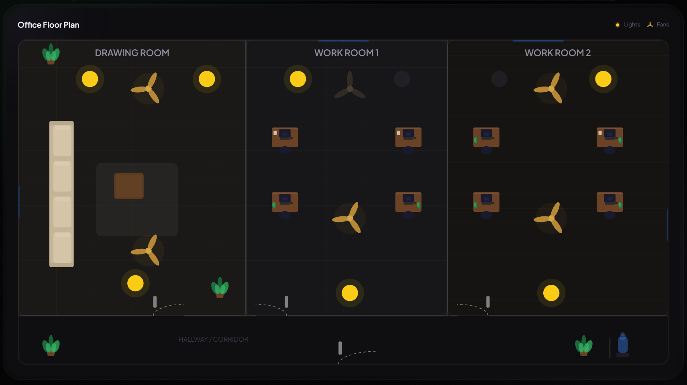
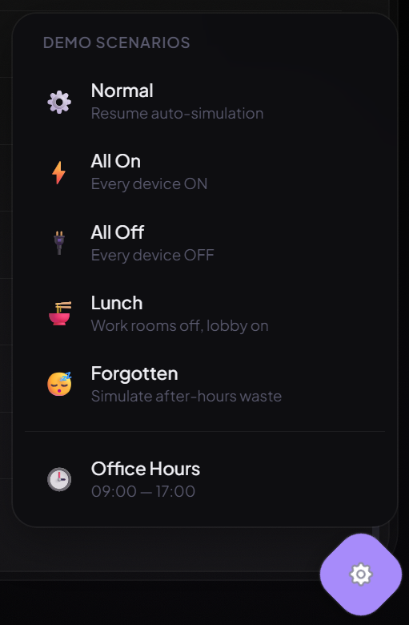
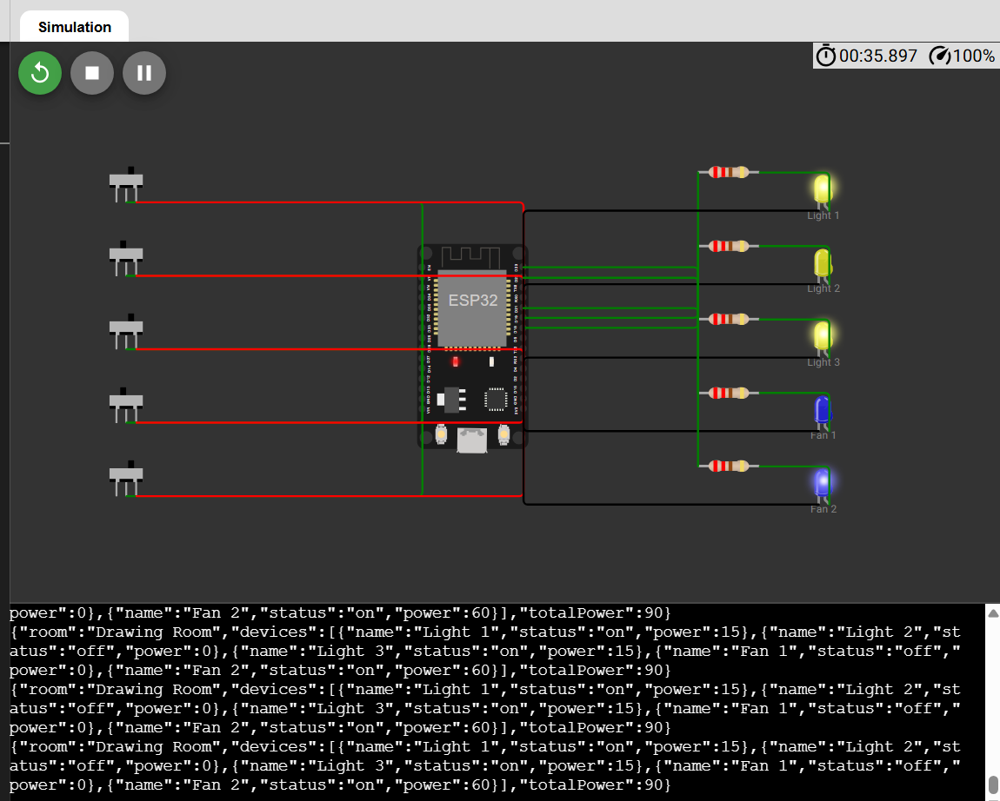

# Office Energy Monitor

> "Lights, Fans, Discord: The Boss's Big Idea"

A real-time office energy monitoring system with a live web dashboard and Discord bot. Monitor all 15 electrical devices (fans and lights) across 3 office rooms through both a web interface and Discord commands.

## Quick Testing (for Judges)

| What                           | Link                                                                                                                                |
| :----------------------------- | :---------------------------------------------------------------------------------------------------------------------------------- |
| Live Dashboard                 | **https://loadwatch.mdnaimurrahman.com**                                                                                            |
| Add Discord Bot to your server | **[Invite Bot](https://discord.com/oauth2/authorize?client_id=1522635268811788308&permissions=67584&integration_type=0&scope=bot)** |

No setup required. The dashboard is live and the bot is already running. Just open the dashboard URL or click the invite link to add the bot to any Discord server you control, then try commands like `!status`, `!room drawing`, `!usage`, and `!alerts`.

## Architecture

Everything runs in a **single FastAPI process** — the simulator, in-memory store, alert engine, REST/WebSocket API, served frontend, and Discord bot.

```
Devices → FastAPI (simulator + store + API + WS + bot) → Dashboard + Discord → User
```



## Screenshots

### Dashboard Overview



### Device Grid



### Power Meter & Power Trend Chart



### Floor Plan



### Demo Scenario Control



### Wokwi Circuit



## Features

### Web Dashboard

- **Live Device Status Grid** — 15 devices grouped by room with real-time on/off indicators
- **Power Consumption Meter** — total office watts + per-room breakdown + daily kWh + estimated cost (BDT)
- **Interactive Floor Plan** — SVG top-view with animated fans (spin) and glowing lights
- **Power Trend Chart** — real-time line chart of power consumption over time
- **Active Alerts Panel** — timestamped after-hours and room-on-2h warnings
- **Change Logs** — full device state change history with timestamps
- **Demo Scenario Control** — trigger preset states (all-on, energy-saver, lunch-break, after-hours-forgotten) for live demos
- **Last Updated Indicator** — proves real-time data flow ("Updated 3s ago")
- **Dark/Light Theme** — toggleable with localStorage persistence

### Discord Bot

| Command        | Description                                                |
| :------------- | :--------------------------------------------------------- |
| `!status`      | Overview of all devices across all rooms                   |
| `!room <name>` | Detailed breakdown of a specific room                      |
| `!usage`       | Real-time power consumption, daily kWh, and estimated cost |
| `!alerts`      | Show currently active alerts                               |
| `!help`        | List all available commands                                |

- Rich embed responses with color-coded severity and room fields
- Humanized, conversational summaries via Groq LLM (with fallback if no API key)
- Proactive alert posting to a designated Discord channel

### Hardware Schematic

- Wokwi-compatible ESP32 circuit modeling one room (Drawing Room)
- 3 yellow LEDs (lights), 2 blue LEDs (fans), 5 slide switches, 5 resistors
- Firmware reads switch states, mirrors to LEDs, outputs JSON every second

### Simulation

Devices toggle randomly with correlated room behavior: when one device turns ON, nearby devices in the same room have a boosted chance of turning ON too. Office hours (configurable from the dashboard or env) are only used by the alert engine to detect after-hours violations — the simulator itself does not depend on real time.

Demo scenarios can force specific states for live presentations: `all-on`, `energy-saver`, `lunch-break`, `after-hours-forgotten`.

## Tech Stack

| Layer       | Technology                                   |
| :---------- | :------------------------------------------- |
| Backend     | Python + FastAPI + uvicorn                   |
| Real-time   | Native WebSockets                            |
| State       | In-memory dict (Pydantic models)             |
| Persistence | SQLite (cumulative kWh + change logs)        |
| Frontend    | React + Vite + TypeScript                    |
| Styling     | TailwindCSS v4                               |
| Animations  | Framer Motion + CSS + SVG SMIL               |
| Charts      | Recharts                                     |
| Bot         | discord.py (in-process)                      |
| LLM         | Groq (Llama 3.3-70b) with templated fallback |
| Circuit     | Wokwi (ESP32)                                |
| Diagram     | Hand-crafted SVG                             |

## Setup

### Prerequisites

- Python 3.12+
- Node.js 18+
- [uv](https://docs.astral.sh/uv/) (Python package manager)
- pnpm or npm

### 1. Clone and install dependencies

```bash
git clone https://github.com/mdnaimur0/iut-techathon-hackathon-preli.git
cd iut-techathon-hackathon-preli

# Python dependencies
uv sync

# Dashboard dependencies
cd dashboard
pnpm install
cd ..
```

### 2. Configure environment

```bash
cp .env.example .env
```

Edit `.env` with your settings:

```env
# Backend / simulation
ELECTRICITY_RATE_PER_KWH=8.0     # BDT per kWh
OFFICE_OPEN_HOUR=9
OFFICE_CLOSE_HOUR=17

# Discord bot (leave blank to disable)
DISCORD_TOKEN=your-bot-token
ALERT_CHANNEL_ID=123456789012345678
GROQ_API_KEY=your-groq-key        # optional; falls back to templated replies
```

### 3. Run in development (two terminals)

```bash
# Terminal 1 — Backend (API + WS + simulator + bot)
uv run uvicorn app.main:app --reload --port 8000

# Terminal 2 — Dashboard dev server
cd dashboard
pnpm run dev
```

Open http://localhost:5173 (Vite default) — the dev server proxies `/api` and `/ws` to the backend.

### 4. Run as single-process demo

```bash
cd dashboard && pnpm run build && cd ..
uv run uvicorn app.main:app --port 8000
```

Open http://localhost:8000 — dashboard + API + WebSocket + Discord bot, all in one process.

## Project Structure

```
iut-techathon-hackathon-preli/
├── pyproject.toml           # uv-managed dependencies
├── uv.lock                  # lockfile
├── .python-version          # Python 3.12
├── .env.example             # environment variables template
├── app/                     # FastAPI application package
│   ├── main.py              # app entry point, lifespan, routes
│   ├── store.py             # in-memory source of truth (15 devices)
│   ├── services.py          # shared read logic (API + bot)
│   ├── simulator.py         # random device state mutation loop
│   ├── alerts.py            # after-hours / room-on-2h engine
│   ├── ws.py                # WebSocket connection manager
│   ├── routes.py            # REST API + scenario endpoints
│   ├── db.py                # SQLite cumulative kWh + change logs
│   ├── models.py            # Pydantic models (Device, Alert, Usage)
│   └── bot/
│       ├── __init__.py      # discord.py bot, embeds, commands
│       └── llm.py           # Groq client + templated fallback
├── dashboard/               # React + Vite + TypeScript frontend
│   ├── public/favicon.svg   # SVG bolt icon
│   ├── src/
│   │   ├── api/ws.ts        # reconnecting WebSocket + scenario trigger
│   │   ├── components/      # DeviceGrid, PowerMeter, PowerChart, FloorPlan,
│   │   │                    # AlertsPanel, LogsPanel, DemoControl, ThemeToggle
│   │   ├── types.ts         # TypeScript types mirroring backend models
│   │   └── App.tsx          # main dashboard layout
│   ├── index.html
│   └── vite.config.ts       # dev proxy to FastAPI
├── hardware/
│   ├── diagram.json         # Wokwi ESP32 circuit
│   ├── sketch.ino           # ESP32 firmware (LED status output)
│   └── README.md            # wiring explanation
├── docs/
│   ├── system-diagram.svg   # architecture diagram (with hardware + LLM)
│   └── screenshots/         # dashboard screenshots
├── others/
│   └── office-layout-top-view.png
└── README.md
```

## API Endpoints

| Method | Endpoint               | Description                                                                                          |
| :----- | :--------------------- | :--------------------------------------------------------------------------------------------------- |
| GET    | `/api/state`           | Current state of all 15 devices                                                                      |
| GET    | `/api/rooms/{id}`      | Detailed status of a specific room                                                                   |
| GET    | `/api/usage`           | Power consumption + daily kWh + estimated cost                                                       |
| GET    | `/api/alerts`          | Active alerts                                                                                        |
| GET    | `/api/logs`            | Recent device state change logs                                                                      |
| POST   | `/api/scenario/{name}` | Trigger a demo scenario (`all-on`, `energy-saver`, `lunch-break`, `after-hours-forgotten`, `normal`) |
| WS     | `/ws`                  | Real-time state + alerts broadcast                                                                   |

## Data Model

The office has 3 rooms × 5 devices = **15 devices total**.

| Room         | Fans | Lights | Total |
| :----------- | :--: | :----: | :---: |
| Drawing Room |  2   |   3    |   5   |
| Work Room 1  |  2   |   3    |   5   |
| Work Room 2  |  2   |   3    |   5   |

Power consumption: Fan ON = 60W, Light ON = 15W. Max office capacity = 495W.

## License

MIT
